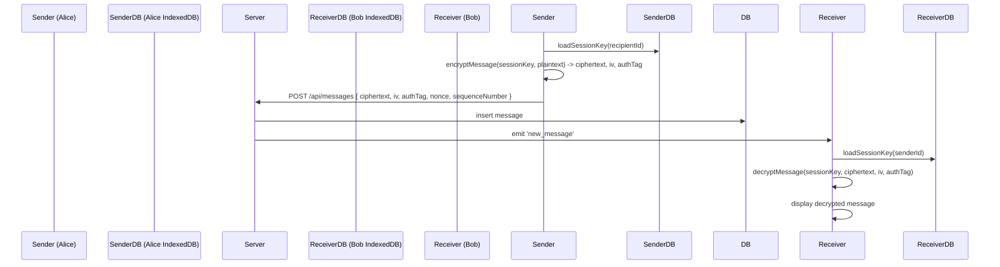

# Secure Messaging System

This repository contains a secure messaging system built with Next.js (client), an Express.js backend server, Socket.IO for real-time events, MongoDB for persistence, and Web Crypto API for client-side cryptography.

> Important security note: In this codebase, the server currently stores raw exported session keys in the database (sessions/session_keys). This breaks E2E encryption and should be removed for real end-to-end security. See `server/index.ts` and `lib/store.ts`.

---

## Features

- End-to-end encryption primitives implemented on the client (ECDSA P-256 for identity signing, ECDH P-256 for ephemeral keys, HKDF for key derivation, AES-GCM 256 for message encryption, HMAC-SHA256 for confirmation).
- Client-side IndexedDB storage for identity and session keys (`lib/indexed-db.ts`).
- Server persists messages, files, key exchange events, confirmations, and security logs in MongoDB.
- Socket.IO used for real-time event relaying.

---

## Repo structure (key files)

- `app/` : Next.js client application (UI and routes)
- `components/` : React UI components
- `hooks/` : Client hooks - `use-crypto.ts`, `use-socket.ts`
- `lib/crypto-client.ts` : Client-side cryptography helpers
- `lib/indexed-db.ts` : Client-side IndexedDB storage
- `server/index.ts` : Express server and Socket.IO
- `lib/store.ts` : Server MongoDB operations
- `lib/mongodb.ts` : MongoDB connection helper
- `scripts/` : Demo / MITM scripts for testing (vulnerable vs secure)

---

## Diagrams

The diagrams below are included as Mermaid code for quick rendering. They're the same diagrams used in documentation (architecture, client flows, key exchange, encryption/decryption, and schema).

### High-level architecture

```mermaid
flowchart TD
  subgraph Client
    UI[UI (Next.js / app/page.tsx)]
    Hooks[Hooks (hooks/use-crypto.ts)]
    Crypto[Crypto (lib/crypto-client.ts)]
    IDB[IndexedDB (lib/indexed-db.ts)]
    SocketClient[Socket.IO Client (hooks/use-socket.ts)]
  end

  subgraph Server
    API[Express API (server/index.ts)]
    SocketServer[Socket.IO Server]
    StoreLib[Store (lib/store.ts)]
    DB[(MongoDB)]
  end

  UI --> Hooks
  Hooks --> Crypto
  Hooks --> IDB
  UI --> SocketClient
  SocketClient --> SocketServer
  API --> StoreLib
  StoreLib --> DB
  SocketServer --> API
  SocketServer --> DB
```

### Client flow (send/receive message)



### Key exchange (authenticated ECDH + confirmation)

```mermaid
sequenceDiagram
  participant Initiator as Alice
  participant Server
  participant Responder as Bob

  Alice->>Alice: generateECDHKeyPair(); exportPublicKeySPKI()
  Alice->>Alice: signData(identityPriv, ephemeralPub:recipientId:ts:nonce)
  Alice->>Server: POST /api/key-exchange {type:init, senderId, recipientId, senderPublicKey, ephemeralPublicKey, signature, timestamp, nonce}
  Server->>Bob: emit 'key_exchange' + persist in key_exchanges

  Bob->>Bob: verifySignature(senderPublicKey, signature, dataToVerify)
  Bob->>Bob: generateECDHKeyPair(); exportPublicKeySPKI(); signData(...)
  Bob->>Server: POST /api/key-exchange {type:response,...}
  Server->>Alice: emit 'key_exchange'

  Alice->>Alice: verifySignature(responderPublicKey, responseSignature, responseData)
  Alice->>Alice: deriveSharedSecret(); deriveSessionKey()
  Bob->>Bob: deriveSharedSecret(); deriveSessionKey()

  Alice->>Server: POST /api/key-confirmation { confirmationHash, confirmationNonce, originalNonce }
  Server->>Bob: emit 'key_confirmation'
  Bob->>Server: POST /api/key-confirmation ...
  Server->>Alice: emit 'key_confirmation'
```

### Database schema (ER): Top-level view

```mermaid
erDiagram
    USERS {
      string id PK
      string username
      string passwordHash
      string publicKey JWK
      number createdAt
    }
    MESSAGES {
      string id PK
      string senderId FK
      string recipientId FK
      string ciphertext
      string iv
      string authTag
      string nonce
      number sequenceNumber
      number timestamp
    }
    FILES {
      string id PK
      string senderId FK
      string recipientId FK
      string filename
      string encryptedData
      string iv
      string authTag
      number size
      number timestamp
    }
    KEY_EXCHANGES {
      string id PK
      string type
      string senderId FK
      string recipientId FK
      string senderPublicKey
      string ephemeralPublicKey
      string signature
      number timestamp
      string nonce
    }
    KEY_CONFIRMATIONS {
      string id PK
      string senderId FK
      string recipientId FK
      string confirmationHash
      string confirmationNonce
      string originalNonce
      number timestamp
    }
    SESSIONS {
      string sessionId PK
      string exportedKey
      number createdAt
    }
    LOGS {
      string id PK
      string event
      string userId
      string details
      string severity
      number timestamp
    }

    USERS ||--o{ MESSAGES : "sends/receives"
    USERS ||--o{ FILES : "shares/receives"
    USERS ||--o{ KEY_EXCHANGES: "initiates/receives"
    USERS ||--o{ KEY_CONFIRMATIONS: "initiates/receives"
    SESSIONS ||--o{ MESSAGES : "sessionId"
```

---

## Setup & Running (Local development)

### Prerequisites

- Node.js (v18+ recommended)
- npm or pnpm (this repo includes a `pnpm-lock.yaml`) - using `pnpm` is recommended for workspace consistency
- MongoDB instance (local or Atlas cluster)

### Environment variables

Create a `.env` file in the project root and in `server/` (server has `dotenv` usage). Example `.env` entries:

```
# server/.env
MONGODB_URI=mongodb://localhost:27017
PORT=5000

# client's env for local dev
NEXT_PUBLIC_API_URL=http://localhost:5000
```

### Install dependencies (root and server)

Using npm:

```powershell
cd C:\Users\DELL\Downloads\secure-messaging-system_new
npm install
cd server
npm install
```

Using pnpm (recommended):

```powershell
cd C:\Users\DELL\Downloads\secure-messaging-system_new
pnpm install
cd server
pnpm install
```

### Start servers

Server (Express + Socket.IO):

```powershell
cd server
npm run dev
# or
pnpm dev
```

Client (Next.js):

```powershell
cd ..\  # project root
npm run dev
# or
pnpm dev
```

Open http://localhost:3000 to view the client (Next.js dev server). Ensure the server is running at http://localhost:5000 as set in `NEXT_PUBLIC_API_URL`.

---

## Scripts & Demos

- Start client dev server: `npm run dev` (root)
- Start server dev: `cd server && npm run dev`
- Demo MITM scripts: `npm run mitm-vulnerable`, `npm run mitm-secure`, `npm run mitm-demo`

---

## Verifying Crypto/Protocol Proofs (Quick steps for demo)

1. Register two users (use the client UI to generate and upload identity public keys).
2. Initiate a key exchange between them (via client UI `initiateKeyExchange`).
3. Inspect the `key_exchanges` collection in MongoDB (via Mongo shell or dashboard). Verify `ephemeralPublicKey` and `signature` exist.
4. Use the browser devtools console (or a Node snippet) and functions from `lib/crypto-client.ts` to verify signatures and confirmations. For example:

- Verify ECDSA signature by reconstructing `dataToSign` string and calling `verifySignature()` with `importECDSAPublicKey()`.
- Verify Key confirmation using `verifyKeyConfirmation()` with locally derived session key.

6. Confirm whether `sessions` or `session_keys` contains `exportedKey`; point out that this allows server to decrypt messages (violating E2E). Use `GET /api/session-key?userId1=<id>&userId2=<id>` or query the `session_keys` collection directly.

---

## Security Notes & Recommendations

- **Do not store raw session keys** (`exportedKey`) on the server; instead, store derived non-reversible metadata or remove persistence entirely.
- Make identity private keys non-extractable or store them in secure hardware-backed keystores (WebAuthn / platform keystore).
- Add authentication (JWT / HttpOnly cookie) so the server can validate `userId` from clients.
- Add rate limiting and monitoring to mitigate DoS.

---

## Troubleshooting

- If the client can't reach the server, verify `NEXT_PUBLIC_API_URL` is set correctly and the server is listening on the configured port (default 5000).
- If Mongo errors occur, check `MONGODB_URI` and the server logs.

---

## Contributing

PRs welcome. Please add tests and update the docs when changing crypto or persistence behaviors.

---

## License

MIT
